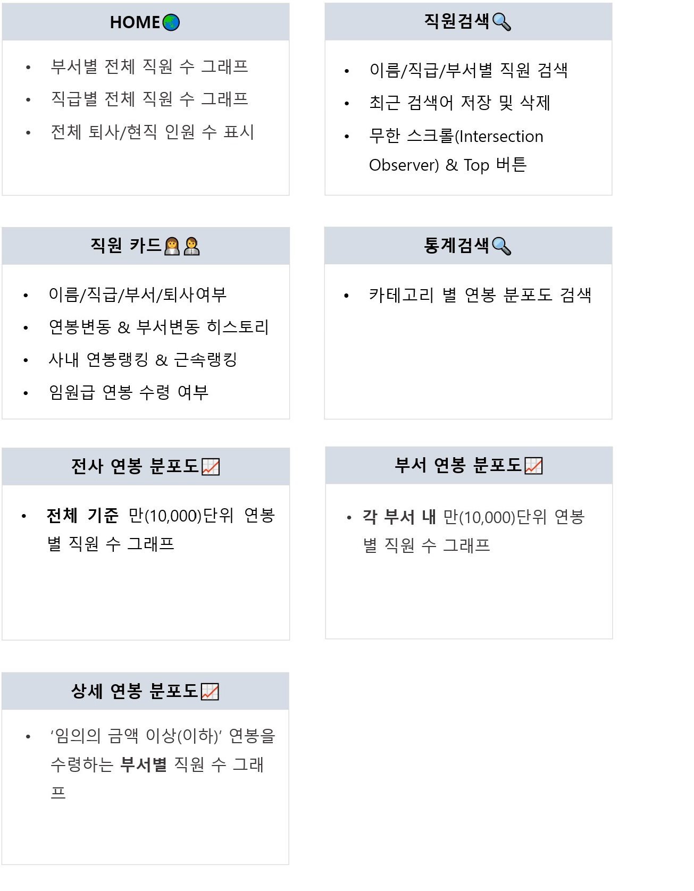
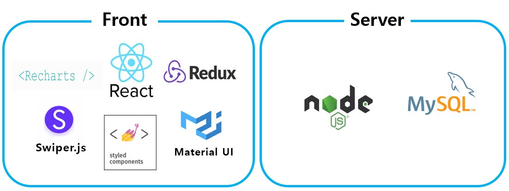

# 👨🏻‍🤝‍👨🏻 Employee Mark (front-end)

 
## MySQL employee DB를 활용한 웹앱 프로젝트
가상 직원 30만명의 이름,부서,직급,연봉변동,부서변동,각종랭킹을 한눈에 파악하고, 직원 전체의 연봉 분포도를 다양한 검색 조건에 따라 확인할 수 있는 웹앱 입니다.  
 
## 🎞 시연 영상

전체 - https://www.youtube.com/watch?v=WgHL5GV_e0A  
반응형 - https://www.youtube.com/watch?v=u8g0WH378vQ
 

## ⚙️ 개발 기능

 

## 🛠️ 기술 스택

 

## 📝 개발노트

프로젝트를 만드는 과정에서 배운 것과 주요 에러를 정리했습니다.

👉[개발노트 보러가기](./developeNote.md)

 
## 👩🏻 Developers
[김은선](https://github.com/EUNSUN23)(FRONT-END), [정주혁](https://github.com/tachyon83)(BACK-END)
 
